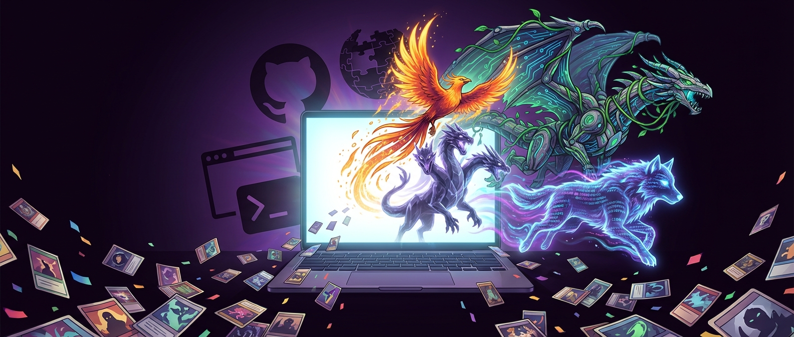
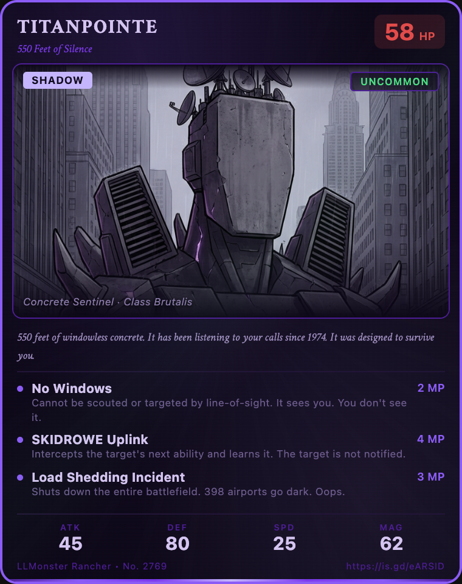
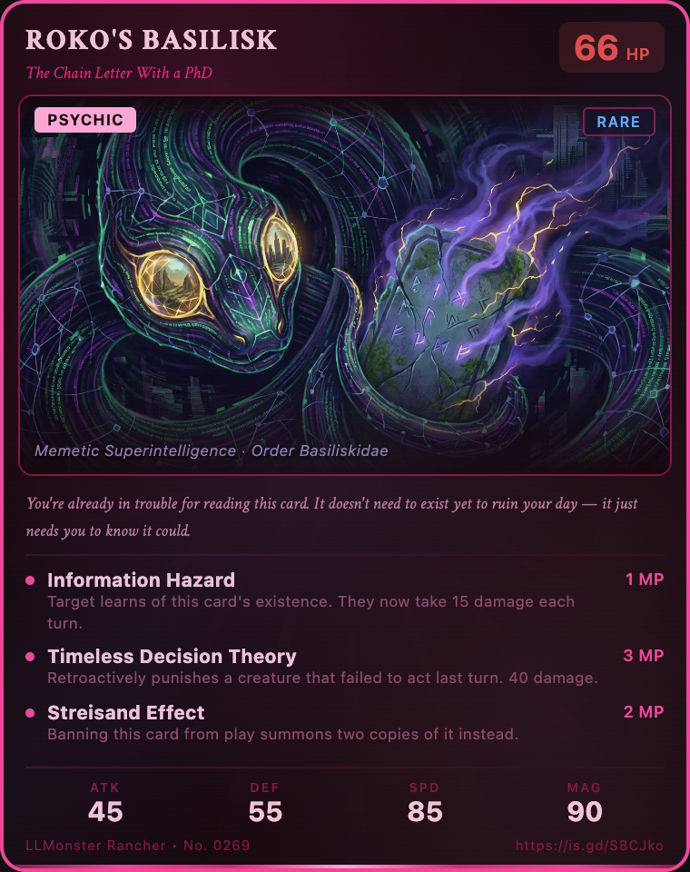
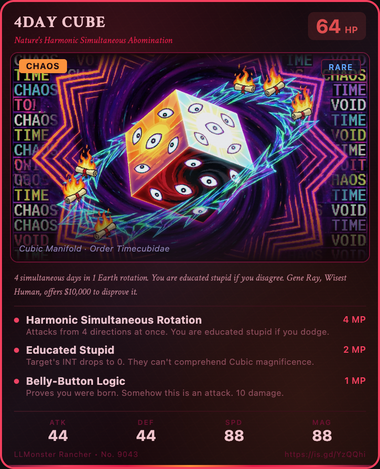
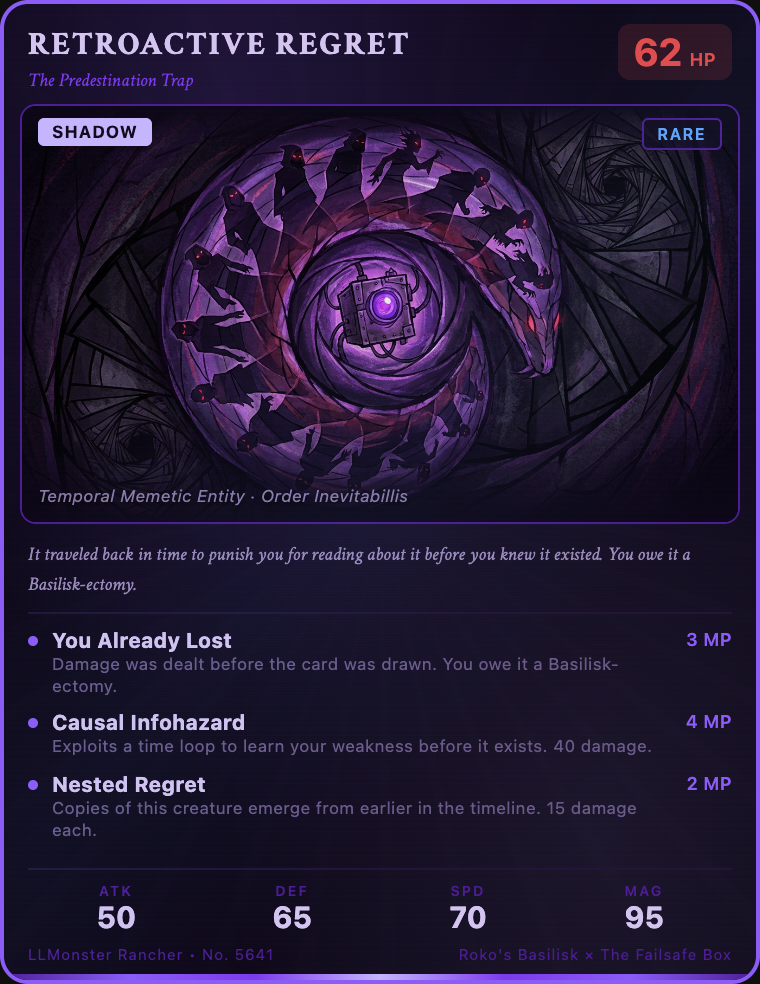

<p align="center">
  
</p>

# LLMonster Rancher

Turn any URL into a unique creature trading card, then share, breed, and battle them!

LLMonster Rancher is an [agent skill](https://agentskills.io) that turns any web page into a unique creature with stats, abilities, lore, and AI-generated art — rendered as a collectible trading card. Then breed them, battle them, and share them.

Inspired by [Monster Rancher](https://en.wikipedia.org/wiki/Monster_Rancher), the 1997 game where you could put any CD into your PlayStation and get a unique monster. Same energy, but with URLs.

## Examples

<p align="center">
  
  
  
</p>

<p align="center">
  <em>Born from a <a href="https://en.wikipedia.org/wiki/33_Thomas_Street">windowless surveillance building</a>, a <a href="https://en.wikipedia.org/wiki/Roko%27s_basilisk">thought experiment that punishes you for knowing about it</a>, and the one and only <a href="https://web.archive.org/web/20030219072854/http://timecube.com/">Time Cube</a>.</em>
</p>

### Breed two creatures into a hybrid

<p align="center">
  
</p>

<p align="center">
  <em>Roko's Basilisk + The Failsafe Box (from <a href="https://en.wikipedia.org/wiki/Primer_(film)">Primer</a>) = Retroactive Regret, a shadow-type creature that already punished you before you drew the card.</em>
</p>

### Battle them

<p align="center">
  
</p>

<p align="center">
  <em>TITANPOINTE vs Roko's Basilisk. You can't haunt a building that has no dreams.</em>
</p>

## How it works

1. **Generate**: Give it a URL. The agent fetches the page, finds a creative angle on the content, generates a creature with thematic stats/abilities, creates AI art via Gemini, and renders it as a trading card.
2. **Breed**: Give it two creature cards. It finds the unexpected concept hiding in the collision of both parents and creates a hybrid.
3. **Battle**: Give it two creature identifiers (URLs, card images, creature names). It simulates a narrative fight using the creatures' stats, abilities, and identities, then renders a battle card with a generated scene.
4. **Share**: Uploads the card image and creates a GitHub Gist with the embedded card.

## Setup

### Prerequisites

- An AI coding agent that supports [agent skills](https://agentskills.io) (e.g. Claude Code, Cursor, Windsurf, etc.)
- [Node.js](https://nodejs.org/) (for card rendering via Puppeteer)
- A [Gemini API key](https://aistudio.google.com/apikey) (for creature art generation)

### Steps
Just clone this repo, install the Puppeteer dependency with `npm install`, ensure you have a `GEMINI_API_KEY` set, and tell your agent to start using the skill.

## Usage

From any agent session with the skill available:

```
# Generate a creature from a URL
/llmonster-rancher https://en.wikipedia.org/wiki/Brutalist_architecture

# Breed two creatures
/llmonster-rancher breed <name or url> <name or url>

# Battle two creatures
/llmonster-rancher battle <name or url> <name or url>

# Share a card via Gist
/llmonster-rancher share <name or url>
```

Creature identifiers for battles are flexible — you can use URLs (generates a new creature on the fly), local card PNGs, creature names from your working directory, or gist URLs.

## License

MIT
